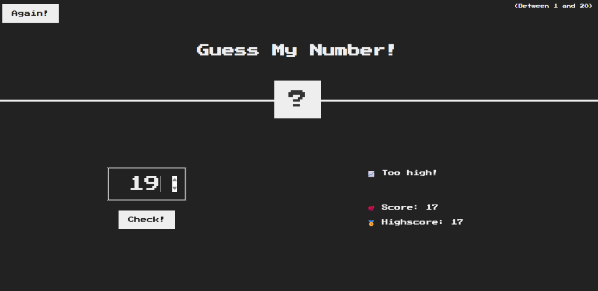
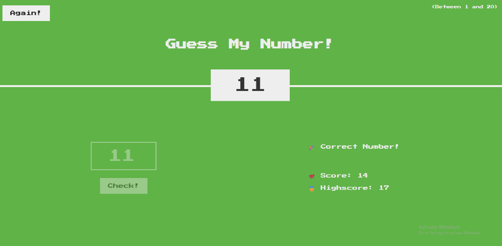
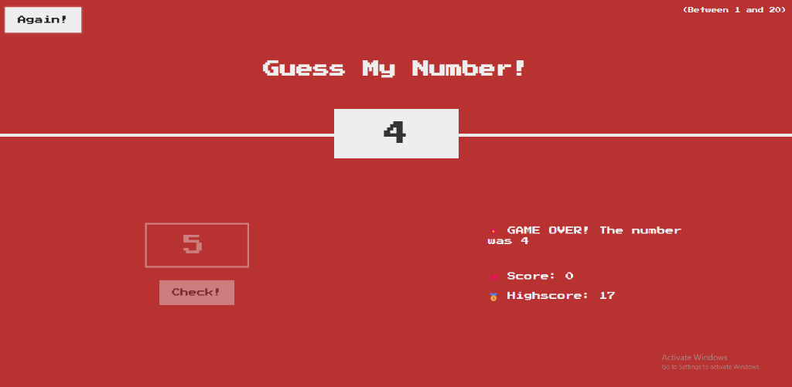

# 🎮 Guess My Number!

A fun, interactive number guessing web game built with pure **Vanilla JavaScript**, **HTML5**, and **CSS3**. The player tries to guess a secret number between 1 and 20 within a limited number of attempts while tracking their highest score.

---

## 🚀 Live Demo

Play the live game directly in your browser:  
👉 **[Play Guess My Number!](https://abdulazim1771.github.io/guess-my-number/)**  
*(Make sure to enable GitHub Pages in your repository settings)*

---

## 📸 Gameplay Preview

| 🎮 Clue: Too Low | 🎮 Clue: Too High |
| :---: | :---: |
|  |  |

| 🎉 Victory (Correct Number!) | 💥 Game Over (Out of Lives!) |
| :---: | :---: |
|  |  |

---

## 🕹️ How to Play

1. **Enter a Guess**: Type an integer between **1 and 20** in the input field.
2. **Submit Your Guess**: Click the **Check!** button or simply press <kbd>Enter</kbd>.
3. **Read the Clues**:
   - 📈 **Too high!**: Your guess is greater than the secret number.
   - 📉 **Too low!**: Your guess is smaller than the secret number.
   - 🎉 **Correct Number!**: You found the secret number! The screen turns green and reveals the number.
   - 💥 **Game Over!**: Your score reached 0, the secret number is revealed, and the screen turns red.
4. **Scoring**:
   - You start each round with **20 points**.
   - Every wrong guess reduces your score by **1 point**.
   - Your highest winning score is preserved as your **Highscore** across rounds.
5. **Play Again**: Click the **Again!** button to start a fresh round without losing your session highscore.

---

## ✨ Features

- **Keyboard Friendly**: Play seamlessly using the <kbd>Enter</kbd> key to submit guesses.
- **Fully Responsive & Mobile Friendly**: Seamlessly adapts to phones, tablets, and desktops with centered stacked layouts and adaptive typography.
- **Dynamic UI & Visual Feedback**: Smooth color transitions (green on victory, red on defeat), retro screen-shake effect, and animated box resizing.
- **Arcade Game Over State**: Reveals the secret number, disables inputs, and pulses the **Again!** button when lives run out.
- **Synthesized 8-Bit Retro Sound Effects**: Zero external audio files—pure Web Audio API synthesized victory fanfare, defeat jingle, and feedback blips.
- **Highscore Tracking**: Retains the highest score achieved during your gaming session.
- **Clean Architecture**: Refactored using **KISS** and **DRY** principles with DOM caching and reusable logic.
- **Zero Dependencies**: 100% lightweight Vanilla JavaScript, HTML5, and CSS3.

---

## 🛠️ Tech Stack

- **HTML5**: Semantic document structure
- **CSS3**: Modern layouts, custom styling, and responsive sizing
- **JavaScript (ES6+)**: DOM manipulation, event-driven programming, and state management

---

## 💻 Running Locally

No build tools or package managers required!

1. Clone this repository:
   ```bash
   git clone https://github.com/Abdulazim1771/guess-my-number.git
   ```
2. Navigate to the project directory:
   ```bash
   cd guess-my-number
   ```
3. Open `source/index.html` in your favorite web browser, or use the VS Code **Live Server** extension.

---

## 🌐 Deploying to GitHub Pages

To make your game playable online via GitHub Pages:

1. Push this project to your GitHub repository (e.g. `guess-my-number`).
2. Go to your repository on GitHub and open **Settings**.
3. In the left navigation menu, click **Pages**.
4. Under **Build and deployment** > **Source**, select **GitHub Actions**.
5. The included workflow (`.github/workflows/deploy.yml`) will automatically deploy the `source` directory to:
   `https://abdulazim1771.github.io/guess-my-number/`

---

## 📄 License

This project is open source and available under the [MIT License](LICENSE).
